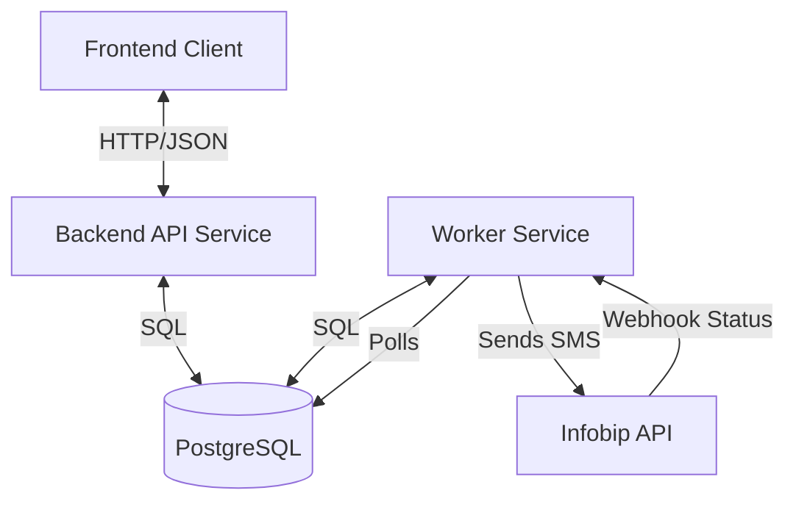

# 📞 Voice Reminder Service

> **Submission for Deadline: 24/12/2025**

A full-stack SaaS platform for scheduling and executing voice/SMS reminders. This project demonstrates a microservices architecture with **FastAPI**, **React**, and **PostgreSQL**.


---

## 💻 Local Service Access

Once running, you can access the services locally at these addresses:

| Service | Local URL | Description |
| :--- | :--- | :--- |
| **Frontend UI** | [http://localhost:5173](http://localhost:5173) | Main user dashboard |
| **Backend API** | [http://localhost:8000/docs](http://localhost:8000/docs) | Interactive Swagger documentation |
| **Worker Service** | [http://localhost:8001/docs](http://localhost:8001/docs) | Worker health and webhook endpoints |

---

## 🏗️ Architecture

The system consists of three main services:



1.  **Backend API**: REST API for managing users and reminders.
2.  **Worker Service**: Background scheduler using `APScheduler`. Handles third-party integrations (Infobip) and webhooks.
3.  **Frontend**: Modern React Application for interacting with the system.

---

## 🚀 How to Run Locally

You will need **3 separate terminal windows** to run this project, plus robust PostgreSQL database access.

### Prerequisites
- **Python 3.11+**
- **Node.js 20+**
- **PostgreSQL 15+** (Running locally on port 5432)

### Step 1: Database Setup
Before starting any services, create the database.

```bash
# Using command line tools
createdb voice_reminder

# OR using SQL shell (psql)
psql -U postgres -c "CREATE DATABASE voice_reminder;"
```

### Step 2: Configuration
Copy the example environment file to create your local config.

```bash
# In the root directory
cp .env.example .env
```
> **Note:** Edit `.env` if your PostgreSQL password differs from the default (`change_me`).

### Step 3: Start Services (Requires 3 Terminals)

#### Terminal 1: Backend API
Runs the core business logic.

```bash
cd backend-api
python -m venv venv

# Windows
venv\Scripts\activate
# Mac/Linux
source venv/bin/activate

pip install -r requirements.txt
alembic upgrade head  # Runs database migrations

# Start Server
uvicorn app.main:app --reload --port 8000
```

#### Terminal 2: Worker Service
Runs the background job processor.

```bash
cd worker-service
python -m venv venv

# Windows
venv\Scripts\activate
# Mac/Linux
source venv/bin/activate

pip install -r requirements.txt

# Start Worker
uvicorn app.main:app --reload --port 8001
```
*You should see logs indicating the "Scheduler started".*

#### Terminal 3: Frontend
Runs the React user interface.

```bash
cd frontend
npm install
npm run dev
```

---

## 🎮 How to Test Local Features

### 1. Mock Mode (Default)
By default, the system runs in `MOCK_MODE=true`. This allows you to test the full flow without spending money or needing external API keys.

1.  **Open** [http://localhost:5173](http://localhost:5173) and check the "Mock Mode" indicator.
2.  **Create** a reminder for 1 minute in the future.
3.  **Watch**:
    - The **Worker Terminal** will log a "Simulated SMS".
    - The **Frontend** will show a toast notification simulating the phone reception.

### 2. Real SMS Mode (Production)
To send actual SMS messages to your phone:
1.  Sign up at [Infobip](https://www.infobip.com/).
2.  Update `.env` with your `INFOBIP_API_KEY` and `INFOBIP_BASE_URL`.
3.  Set `MOCK_MODE=false`.
4.  Restart the **Worker Service**.

---

## ⚙️ Environment Config

| Key | Description |
| :--- | :--- |
| `DATABASE_URL` | PostgreSQL connection string. |
| `MOCK_MODE` | Toggle `true` (Simulated) or `false` (Real SMS). |
| `SCHEDULER_INTERVAL_SECONDS` | Frequency of checks for due reminders. |
| `WEBHOOK_URL` | Usage for real delivery reports (requires `ngrok` for localhost). |

---

## 🧪 Running Tests

To verify everything is working correctly:

```bash
# Run integration tests (Mock System)
python test_mock_system.py
```

Or run unit tests for specific services:
```bash
# Backend
cd backend-api && pytest

# Worker
cd worker-service && pytest
```

---
*Built for the 24/12/2025 Submission.*
